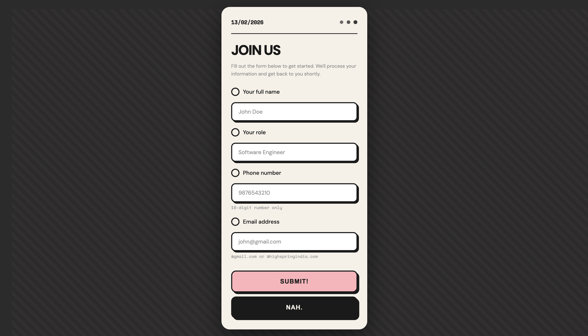

# User Registration Form Application

This is a Flask-based web application that provides a modern, responsive user registration form. The application collects user details (Name, Role, Contact Number, Email) and stores the data in a CSV file on Google Cloud Storage.

## Features

- **Modern UI**: Neo-brutalist design with animated background and interactive elements.
- **Form Validation**: Client-side and server-side validation for contact numbers (10 digits) and specific email domains (`gmail.com`, `highspringindia.com`).
- **Cloud Storage**: Automatically uploads form submissions to a Google Cloud Storage bucket.
- **Responsive Design**: Works seamlessly on desktop and mobile devices.

## Screenshot




## Prerequisites

- Python 3.7+
- Google Cloud SDK (for GCS authentication)
- `pip` (Python package manager)

## Installation

1.  **Clone the repository:**

    ```bash
    git clone <repository-url>
    cd cloud-run-project-ass-1
    ```

2.  **Install dependencies:**

    Create a virtual environment (optional but recommended):

    ```bash
    python -m venv venv
    source venv/bin/activate  # On Windows: venv\Scripts\activate
    ```

    Install the required packages:

    ```bash
    pip install flask google-cloud-storage
    ```

## Configuration

The application uses the following configuration variables in `app.py`:

- `BUCKET_NAME`: The name of the Google Cloud Storage bucket (default: `user-form-data-bucket-123`).
- `FILE_NAME`: The name of the file to store data in (default: `users.csv`).

Ensure you have authenticated with Google Cloud:

```bash
gcloud auth application-default login
```

## Running the Application

Run the Flask application:

```bash
python app.py
```

The application will be available at `http://localhost:5000`.

## Project Structure

- `app.py`: Main Flask application handling routes, validation, and GCS upload.
- `templates/form.html`: The HTML template containing the form structure, styles, and JavaScript.

## Tech Stack

- **Backend**: Python, Flask
- **Frontend**: HTML5, CSS3, JavaScript
- **Storage**: Google Cloud Storage
